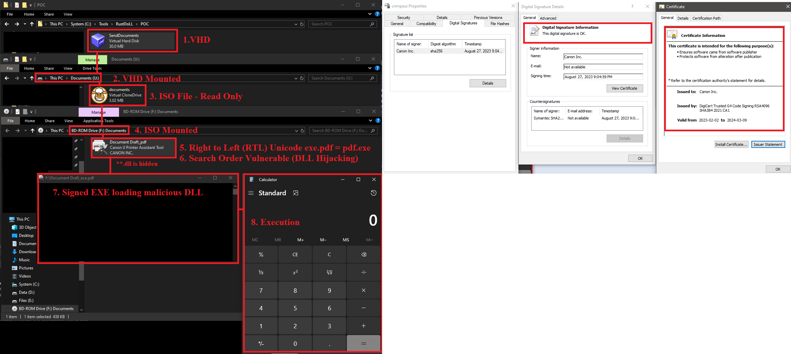

### Technical Analysis: The VHD > ISO > RTLO > Hidden DLL Sideloading Chain

This execution sequence is a highly calculated stack of defense-evasion tactics. Each individual mechanism is designed to solve a specific problem for an attacker-ranging from defeating secure email gateways to tricking the end-user and bypassing endpoint detection (EDR).

When combined, they form a highly effective initial access pipeline.

1. Delivery: The user downloads or receives an ISO file.
2. First Mount: The user double-clicks the VHD, mounting it as a second virtual hard drive. Inside are the actual execution files.
3. Second Mount: The user double-clicks the ISO, mounting it as a virtual disc drive. Inside is a hidden or visible VHD (Virtual Hard Disk) file.
4. ### Anti-Analysis & Masquerading Techniques
*   **File Hiding:** The malicious proxy DLL (`.dll`) is marked with the `Hidden` file attribute inside the VHD structure. This ensures that a standard user browsing the mounted drive only sees the primary launcher file.
*   **RTLO Unicode Spoofing:** The legitimately signed Canon executable uses the Right-to-Left Override Unicode character (`U+202E`) to trick the user into thinking they are opening a safe document format:
    *   *Apparent name seen by user:* `Document_fdp.exe`
    *   *Actual execution target:* `Document_[RTLO]fdp.exe` (which interprets the system extension as an executable while reversing the string sequence visually).
5. Execution: The user runs a legitimately signed Canon Executable.
6. Side-Loading: The Canon executable automatically looks for and loads a companion Proxy DLL placed in the same folder.
7. Trigger: The DLL executes the final payload, spawning calc.exe.

## Reference
- https://www.elastic.co/security-labs/Hunting-for-Suspicious-Windows-Libraries-for-Execution-and-Evasion
