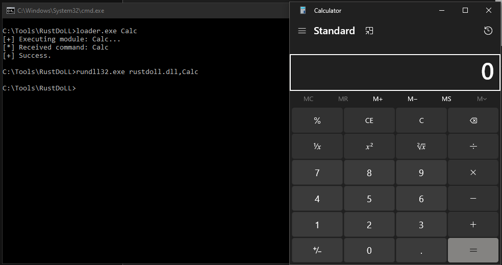
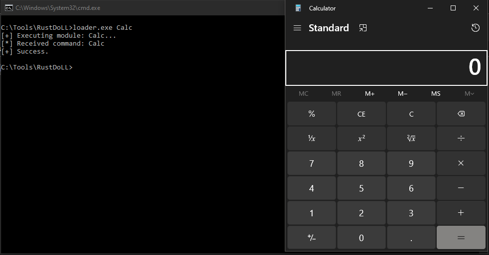
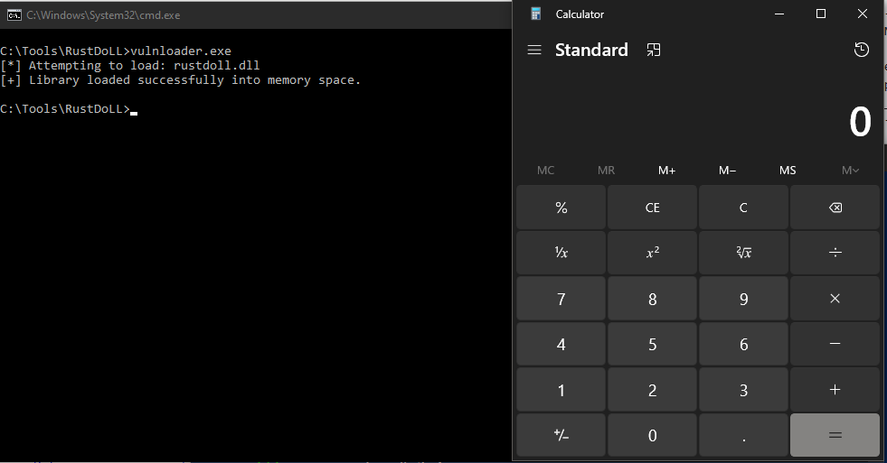

# RustDoLL: DLL Sideloading Research

A modular Windows project designed for educational research into **DLL Sideloading**, search order vulnerabilities, and dynamic library injection. This repository provides a controlled sandbox environment to analyze how the Windows operating system loads and links external dependencies at runtime.


## Educational Purpose

This project provides a sandbox for understanding:

* **Dynamic Linking:** How Windows maps external libraries into process memory.
* **Export Table Resolution:** How host applications locate and execute functions inside a loaded DLL.
* **Standalone Testing:** How the Windows loader treats a DLL as a modular, self-executing component.
* **Process Context:** How injected code inherits the permissions and environment of the host process.
* **Search Order Behavior:** How operating systems locate resources when absolute paths are omitted, and the corresponding secure development practices (e.g., using `LoadLibraryExW` with strict directory flags) required to enforce safe dependency verification.
* **No Evasion/Obfuscation:** It doesn't have these features, this is purely for testing.

---
### Historical & Notable Attacks Utilizing Sideloading

DLL Sideloading has a long history of deployment across both targeted espionage campaigns and broader cyber operations to quietly introduce malware into a target network:

* **Operation Shady RAT (2011) & Early APT Campaigns:** Historically, state-sponsored actors frequently used legitimate but vulnerable binaries (such as older versions of security software or media players) to side-load customized remote access trojans (RATs) into compromised environments to blend in with normal network traffic.
* **The GUP / Notepad++ Infrastructure Exploitation:** Threat actors targeting developer environments compromised updater pipelines to distribute malicious payloads. Attacks deployed the authentic updater binary (`GUP.exe`) alongside a crafted `libcurl.dll` file designed to mimic standard updater network behavior while executing underlying implant chains under a trusted process identity.
* **PlugX Malware Delivery:** Various Advanced Persistent Threats (APTs) heavily rely on a strict three-file execution chain to load the PlugX trojan. The chain consists of an authentic signed executable (often a third-party antivirus component), a hijacked loader DLL triggered via search order abuse, and an encrypted raw payload file (e.g., `.dat` or `.bin`) that the loader reads and executes reflectively in memory.
* **Post-Exploitation TTPs (SolarWinds/SUNBURST Landscape):** While the initial SUNBURST entry point was a supply-chain code modification inside a signed component, monitoring agencies noted that the attackers subsequently leaned heavily on localized file placements, temporary utility replacements, and customized memory-resident execution frameworks in their secondary phases to blend into legitimate enterprise administration paths.

### Why Search Order Vulnerabilities (SOV) Are Critical to Monitor

Search Order Vulnerabilities occur when an application fails to specify an absolute path to a required dependency, allowing the operating system's default lookup sequence to dictate execution. This behavior is a critical security concern for several operational reasons:

* **Privilege Escalation:** If a high-privilege application or system service (running as `SYSTEM` or `Administrator`) suffers from an SOV, an unprivileged user with write access to the application's directory can place a modified DLL there to execute code with elevated permissions.
* **Trust Exploitation (Bypassing Application Whitelisting):** Because the initial binary being launched is completely legitimate and digitally signed (e.g., a trusted system utility or vendor application), traditional security rules that only validate the executable's signature may permit the process to run, completely missing the untrusted code running inside it.
* **Persistence:** Threat actors often use sideloading to maintain long-term access to an environment. By planting a modified DLL next to a legitimate, frequently used program or startup service, their payload executes automatically whenever that program starts.

---

## Project Source Structure

The project utilizes a Rust workspace to maintain strict separation between the payload library, the explicit test harness, and the simulated vulnerable host:

```text
RustDoLL/
├── Cargo.toml               # Workspace configuration
├── README.md                # Project documentation
├── dll_project/             # Core library (The Payload)
│   ├── Cargo.toml           # DLL-specific dependencies
│   └── src/
│       └── lib.rs           # Export definitions (Void, Calc, DllMain)
├── loader_project/          # Test harness (The Host)
│   ├── Cargo.toml           # Loader-specific dependencies
│   └── src/
│       └── main.rs          # Logic to LoadLibrary via absolute path and call exports
└── vulnloader_project/      # Simulated Vulnerable Exe (Search Order Abuse)
    ├── Cargo.toml           # Vulnloader-specific dependencies
    └── src/
        └── main.rs          # Logic to load dependencies via bare name string

```

## Build Instructions

1. **Clone the repository.**
2. **Option 1: Build the DLL and Loader:**
```bash
cd RustDoLL
cargo build --release

```
Output
```
C:\Users\Builder\RustDoLL>cargo build --release
   Compiling loader v0.1.0 (C:\Users\Builder\RustDoLL\loader_project)
   Compiling rustdoll v0.1.0 (C:\Users\Builder\RustDoLL\dll_project)
   Compiling vulnloader v0.1.0 (C:\Users\Builder\RustDoLL\dll_project)
    Finished `release` profile [optimized] target(s) in 1.36s
```

3. **Option 2: Build the manually:**
```bash
cd ../loader_project
cargo build --release

```

```bash
cd ../dll_project
cargo build --release

```

```bash
cd ../vulnloader_project
cargo build --release

```
**Loader and DLL Compiled Location**
```
C:\Users\Builder\RustDoLL\target\release
```

## Customization for VisitURL and CheckIn Module via Webhook.site
To customize the behavior of the DLL before compiling:

### 1. Networking Endpoints
Open `dll_project/src/lib.rs` and locate the `visit_url_logic` and `check_in_logic` functions. Update the URL strings as follows:

```rust
// In lib.rs
fn visit_url_logic() {
    let url = "https://your-target-url.com"; // UPDATE THIS
    // ...
}

fn check_in_logic() {
    let url = "https://your-webhook-endpoint.com]"; // UPDATE THIS
    // ...
}
```

## Usage

### Method 1: Standalone Testing (`rundll32`)

You can test the functionality of `RustDoLL.dll` as a standalone unit using the native Windows `rundll32.exe` utility.

```cmd
rundll32.exe dll_project\target\release\RustDoLL.dll,<function_name>

```

*Example:* `rundll32.exe RustDoLL.dll,Popup`



### Method 2: Simulated Sideloading (`loader`)

This method demonstrates how a host application manually maps the DLL and resolves the `ExecuteCommand` entry point to pass dynamic instructions.

* **Run:** `loader.exe <module_name>`
* **Example:** `loader.exe Calc`



### Method 3: Simulated Vulnerable Loader (`vulnloader`)

This method demonstrates how an application natively succumbs to a Standard Search Order vulnerability by omitting absolute paths, forcing the OS to look in the application's local directory first.
The vulnloader.exe is used to demonstrate a vulnerable application.

* **Run:** `vulnloader.exe`
* **Example:** `vulnloader.exe` *(Simply drop the payload as `rustdoll.dll` in the same directory and execute)*



#### How It Works

Unlike the primary test harness which manually targets a specific path, `vulnloader` requests a standard system module (`rustdoll.dll`) using an implicit bare filename. When executed, the Windows OS Loader sequentially checks the directory structure, prioritizing the local application folder. 

1. **Staging:** The researcher renames the compiled payload `RustDoLL.dll` to `rustdoll.dll` and places it right next to `vulnloader.exe`.
2. **Execution:** On launch, `vulnloader.exe` calls `LoadLibraryW("rustdoll.dll")`. 
3. **Hijack:** The Windows loader identifies the local `rustdoll.dll` at Position #1 of the Search Order, maps it into the process memory space, and instantly triggers your automated `DllMain` payload.

---

### Method 4: Automated Execution vs. Function Targeting

A quick structural breakdown contrasting how the application handles your code based on the execution vector chosen:

| Execution Method | Primary Trigger Point | Requirements |
| :--- | :--- | :--- |
| **Method 1 (`rundll32`)** | Explicit Export String | Requires strict `pub extern "system"` 4-argument stack alignment to prevent crashes. |
| **Method 2 (`loader`)** | `GetProcAddress` Lookup | Relies on finding exact explicit function names (`Calc`, `Popup`) in the Export Address Table. |
| **Method 3 (`vulnloader`)** | `DllMain` (`DLL_PROCESS_ATTACH`) | Executes instantly upon mapping. Requires an independent background thread wrapper to escape the OS Loader Lock. |

## Payload Modules Reference

| Module | Description |
| --- | --- |
| **`ExecuteCommand`** | Universal entry point; accepts string parameters via memory pointer. |
| **`Calc`** | Spawns the Windows Calculator (`calc.exe`). |
| **`Cmd`** | Spawns a new Command Prompt (`cmd.exe`). |
| **`Powershell`** | Spawns a new PowerShell instance. |
| **`Notepad`** | Launches Notepad (`notepad.exe`). |
| **`Popup`** | Displays a native Windows "Info" message box. |
| **`VisitUrl`** | Triggers a remote HTTP GET request for network beaconing study. |
| **`CheckIn`** | Fingerprints system data (User/Host) for situational awareness. |
| **`RunAll`** | Sequential execution of `Calc` and `Notepad` payloads. |

## Disclaimer

*This project is intended for educational and security research purposes only. Use only on systems you own or have explicit authorization to test. The unauthorized loading of DLLs into processes can be flagged by security software as malicious behavior.*

## Referrence

* [InfoSec Writeups: DLL Search Order Hijacking – Finding and Exploiting the Flaw](https://infosecwriteups.com/dll-search-order-hijacking-finding-and-exploiting-the-flaw-9f5dabaa2470)
* [Medium (R3dLevy): Evading Windows Security – A List of AppLocker Bypass Techniques with LOLBAS](https://medium.com/@R3dLevy/evading-windows-security-a-list-of-applocker-bypass-techniques-with-lolbas-2f0568a59ffd)
* [R-TEK Blog: Understanding DLL Sideloading Techniques and Mechanics](https://www.r-tec.net/r-tec-blog-dll-sideloading.html)
* [Red Canary Threat Detection Report: Analysis of Rundll32 Execution and Detection Vectors](https://redcanary.com/threat-detection-report/techniques/rundll32/)
* [Google Cloud Threat Intelligence Blog: Abusing DLL Misconfigurations and Search Paths](https://cloud.google.com/blog/topics/threat-intelligence/abusing-dll-misconfigurations)
* [Microsoft Support Guidance on Safe Library Loading](https://support.microsoft.com/en-us/servicing/os/windows/2017/01/secure-loading-of-libraries-to-prevent-dll-preloading-attacks)
* [Google Cloud Blog on Abusing DLL Misconfigurations](https://cloud.google.com/blog/topics/threat-intelligence/abusing-dll-misconfigurations)
* [Bitdefender TechZone on DLL Sideloading Behavior](https://techzone.bitdefender.com/en/tech-explainers/what-is-dll-sideloading.html)
* [Broadcom Security Center Protection Bulletin](https://www.broadcom.com/support/security-center/protection-bulletin/protection-highlight-dll-sideloading-a-stealthy-attack-vector)
* [Trellix Research on PlugX Talisman Variants](https://www.trellix.com/blogs/research/plugx-a-talisman-to-behold/)
* [Dark Atlas KorPlug Malware Analysis](https://darkatlas.io/blog/plugx-dll-sideloading-via-msi-installer-complete-malware-analysis-of-a-korplug-campaign)
* [Microsoft Security Blog on Active Web Help Desk Exploitation](https://www.microsoft.com/en-us/security/blog/2026/02/06/active-exploitation-solarwinds-web-help-desk/)
